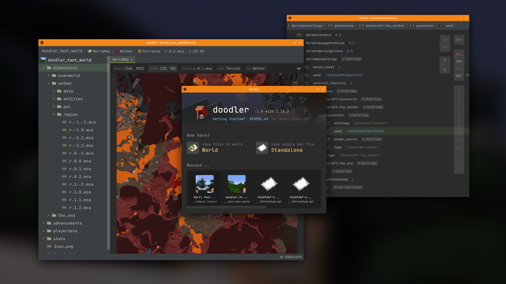

# doodler - minecraft nbt editor
마인크래프트 Java Edition의 NBT 데이터를 수정하기 위한 도구입니다.  

🚧 **아직 개발 중이에요!** 불안정할 수 있고, 맵이 손상될 수도 있으니 클론/빌드해서 사용하신다면 그 전에 맵을 먼저 백업해주세요. 

## 기능
주된 기능은 역시 **NBT의 수정**입니다.  
dat 파일이나 nbt 파일, 혹은 mca 파일을 열어 내용을 확인하거나 수정할 수 있습니다.  

추가적으로, mca 파일의 경우 월드 에디터를 통해 접근하면 해당 mca 지역의 **지도**를 볼 수 있습니다.  
yLimit을 설정하여 일정 좌표 이상의 블럭은 지도 렌더에서 제외할 수 있으며, 따라서 지형을 y값 기준으로 잘라 그 단면을 확인하는것도 가능합니다.  
MCA 파일을 직접 선택하거나, Hierarchy의 'dimensions' 항목을 선택하면 지도 기능을 사용할 수 있습니다. 또, 이렇게 출력된 지도에서 특정 청크를 선택하여 그의 NBT 데이터를 수정할 수도 있습니다.  
MCA 파일을 직접 선택하여 열면 열리는 지도는 해당 지역만 확인할 수 있으며, 월드 내에 로드된 모든 지역에 대해 전역적으로 확인하려면 Hierarchy의 'dimension' 항목을 사용해주세요.

## 사용
- 탐색할 파일이나 월드를 정하고, 메인 윈도우에서 맞는 항목을 선택합니다.
- 파일 선택 윈도우가 열리면, 월드나 파일의 경로를 입력합니다. OS의 기본 탐색기를 통해 파일을 찾은 후 경로를 복사하여 붙혀넣으면 편리합니다.  
  ~~이건 좀 더 편하게 만들고 싶었는데 사용하는 프레임워크에서 그걸 원만하게 지원하지 않고 있어서...~~
- 선택을 완료하면 에디터가 열립니다. 편집을 시작합니다!
- NBT파일을 선택할 경우 파일의 내용이 출력되며, 우측의 작업 메뉴를 선택하여 수정을 시작할 수 있습니다.  
  - NBT태그 각각을 '좌클릭'하면 해당 태그가 펼쳐질 수 있는 태그(Compound이거나 등등)일 경우 펼쳐집니다. 그렇지 않으면 아무일도 일어나지 않습니다.  
  - NBT태그 각각을 '우클릭'하면 해당 태그를 '선택' 합니다. 알고계시는데로 Shift 및 Ctrl을 통해 여러 항목을 선택할 수 있고, 선택 항목에 따라 접근할 수 있는 우측의 작업 메뉴가 달라집니다.
  - 우측의 작업 메뉴를 통해 수정할 수 있습니다.
    - SAV: 변경 사항을 저장합니다.
    - DEL: 선택한 태그를 제거합니다.
    - EDT: 선택한 태그의 이름과 값을 수정합니다. 다만, 태그가 Compound, List, Array 중 하나일 경우 이름만 수정할 수 있습니다.
    - CPY: 선택한 태그를 복사합니다. 선택된 태그의 조합에 따라 복사가 불가능할 수 있습니다.
    - PST: 클립보드에 있는 데이터를 붙혀넣습니다. 클립보드 데이터에 있는 태그의 조합에 따라 붙혀넣기가 가능한 태그와 그렇지 않은 태그가 있을 수 있습니다.
    - 왼쪽 화살표 및 오른쪽 화살표는 각각 실행취소 및 다시실행을 의미합니다.
    - 위쪽 화살표는 선택한 태그를 위로 한 칸, 아래쪽 화살표는 선택한 태그를 아래로 한 칸 이동합니다.
    - 나머지 항목은 태그를 생성할 수 있는 메뉴입니다. 
      **B**yte, **S**hort, **I**nteger, **L**ong, **F**loat, **D**ouble 태그와 가능한 그의 배열 타입, **{ }** - Compound 및 **[ ]** - List, **...** - String 태그를 생성할 수 있습니다. 

## 주절주절
아직 가져다 쓰기에는 여러 모로 불편합니다. 얼마 없는 기능에 대해 그마저도 UI가 불친절하기도 하구요.  
그리고 NBT를 직접 수정하면 마인크래프트 클라이언트에서 여러 사이드 이펙트를 발생시킬 수 있기 때문에, 꼭 필요한 경우가 아니면 추천드리지 않습니다.

무엇보다, NBT를 직접 수정하면 재미가 없어요... 특수한 맵을 제작하려고 하거나 하는 경우가 아니라면 굳이 이게 아니어도 커맨드나 여러 모드를 통해 하는게 더 안정적이니까요.

그리고, JSON파일에 대해서는 아직은 따로 기능을 추가할 계획이 없습니다. 텍스트 편집기로도 수정할 수 있으니까요.  

### 프레임워크
Jetbrains 사에서 개발한 오픈소스 프레임워크 Jetpack Compose 를 사용했습니다.  
이 프로젝트가 데스크탑 환경을 타겟으로한 첫 프로젝트인데, 자바 스윙은 너무 못생겼고 닷넷은 아직 C#이 익숙하지 않았어요.  
무엇보다 Jetpack Compose 는 선언형이면서 반응적이게 UI 로직을 작성할 수 있어서, 아무래도 ~~질리도록~~ 많이 살펴봤던 React와 비슷하겠구나 싶어서 이 프레임워크를 썼습니다. ~~근데 React처럼 짜려고 하면 망함~~

### 메인 브랜치 이름이 왜저래요?
메인 브랜치 이름을 보고 기함하신 분이 많으실 것 같습니다.  
기함하신 대로 별 의미 없이 바꾼게 맞고... 전체적으로 한 번 코드를 갈아엎고 리팩터링을 했는데 그 이전 작업이 activator 브랜치에, 그 이후가 blackstone 브랜치에 기록되고 있습니다.

### 앞으로는?
앞으로 아래와 같은 몇몇 기능을 추가해보려고 합니다. 물론 계획일 뿐이고 언제든지 중간에 던지거나 취소될 수 있는 것들이니 크게 기대하지는 말아주세요(?)
- NBT 값에 대한 설명이나 힌트를 볼 수 있게 함
- NBT에 대해 잘 모르는 사람도 사용할 수 있게 툴 내에 일부 NBT에 대한 내용이나 마인크래프트의 데이터 형태에 대한 문서를 내장
- 맵의 지형을 수정할 수 있는 매크로 작성 기능  
  예를 들면 '(x1, y1, z1)에서부터 (x2, y2, z2) 범위 내에서 특정 조건을 만족할 경우 특정 블럭 설치 혹은 교체'같은걸 매크로로 작성한다던지 말이죠.  
  물론 이 기능은 조명과 관련하여 마인크래프트 클라이언트의 '월드 최적화' 기능을 써야 비로소 완벽해질 수 있겠습니다만, 아무튼요.
